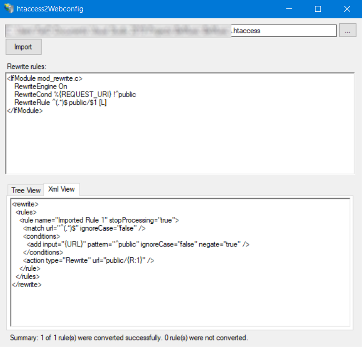

# htaccess2WebConfig
As it is coming from the name, this tool is for converting your htaccess rules to .net WebConfig.
this is and independent build based on microsoft rewrite 2.0 module for IIS.
it has live change support; when modifying the htaccess in text area it will immediately update the WebConfig output.
it is written in VS2019 and here is a screenshot of applcation :

  

